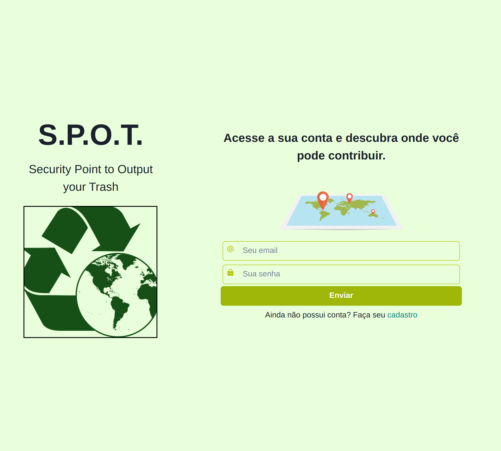

# S.P.O.T.

Este é o front-end da aplicação que encontra os pontos de descarte mais próximos de você. 

Você faz o seu cadastro e acrescenta o seu endereço para que assim possamos fazer este cálculo automaticamente.

Ao acessarmos, podemos lhe direcionar, caso exista pontos de coleta na sua cidade. 

